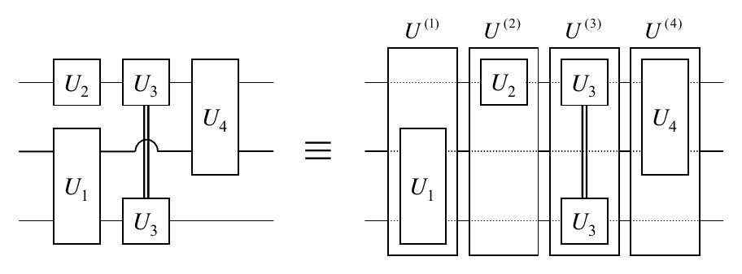
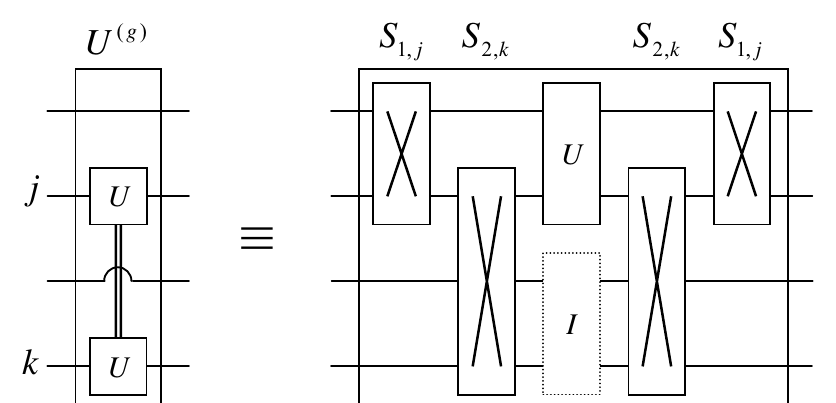
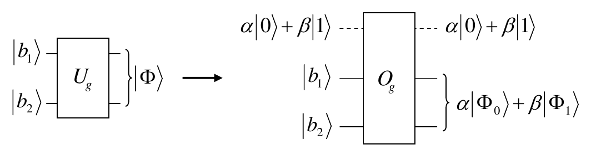
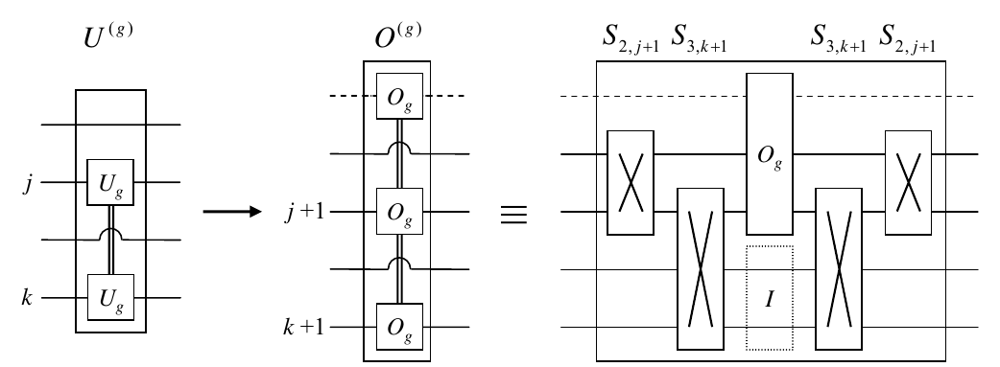
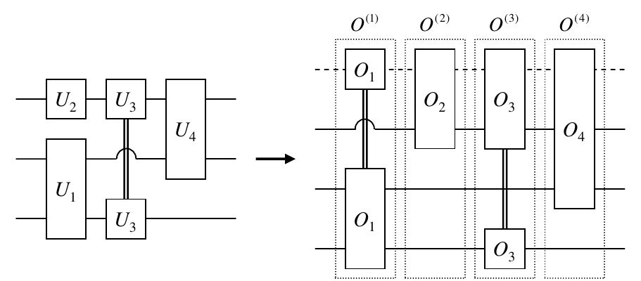
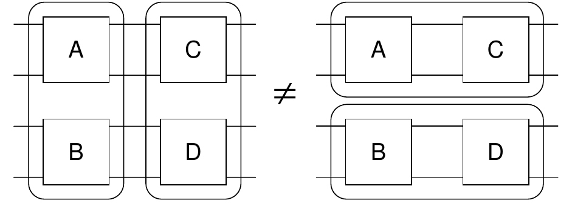
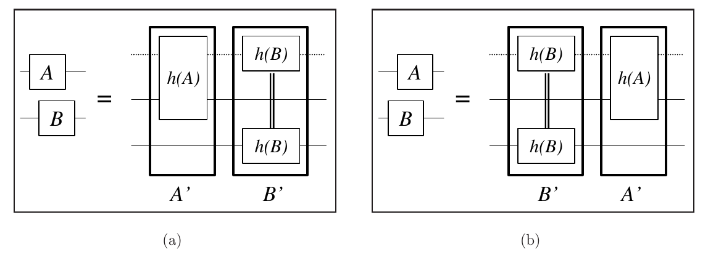

# Quaternionic Computing

**José M. Fernandez, William A. Schneeberger**  
**February 1, 2008**  
*arXiv:quant-ph/0307017v2, 5 Nov 2004*

## Abstract

We introduce a model of computation based on quaternions, which is inspired on the quantum computing model. Pure states are vectors of a suitable linear space over the quaternions. Other aspects of the theory are the same as in quantum computing: superposition and linearity of the state space, unitarity of the transformations, and projective measurements. However, one notable exception is the fact that quaternionic circuits do not have a uniquely defined behaviour, unless a total ordering of evaluation of the gates is defined. Given such an ordering a unique unitary operator can be associated with the quaternionic circuit and a proper semantics of computation can be associated with it.

The main result of this paper consists in showing that this model is no more powerful than quantum computing, as long as such an ordering of gates can be defined. More concretely we show, that for all quaternionic computation using $n$ quaterbits, the behaviour of the circuit for each possible gate ordering can be simulated with $n+1$ qubits, and this with little or no overhead in circuit size. The proof of this result is inspired of a new simplified and improved proof of the equivalence of a similar model based on real amplitudes to quantum computing, which states that any quantum computation using $n$ qubits can be simulated with $n+1$ rebits, and in this with no circuit size overhead.

Beyond this potential computational equivalence, however, we propose this model as a simpler framework in which to discuss the possibility of a quaternionic quantum mechanics or information theory. In particular, it already allows us to illustrate that the introduction of quaternions might violate some of the “natural” properties that we have come to expect from physical models.

## 1 Introduction

Quantum Computing represents yet another disconcerting puzzle to Complexity Theory. What we know today is that quantum computing devices can efficiently solve certain problems, which, in appearance, classical or probabilistic computers cannot solve efficiently. Even though we would like to believe that quantum computing violates the strong Church-Turing thesis, the sore truth is that the known results do not provide us a proof, only constituting, at best, “strong evidence” thereof.

Yet, even though we cannot provide a strict separation between these models, we do know certain inclusions between variations of these computing models. Perhaps the most natural variation from standard Quantum Computing is that in which we change the domain of the state vector amplitudes, and hence the domain of their allowed linear transformations.

It was first shown that restricting ourselves to real amplitudes does not diminish the power of quantum computing [7], and further, that in fact rational amplitudes are sufficient [1]. Both these results were proven in the Quantum Turing Machine model, and the respective proofs are quite technical. Direct proofs of the first result for the quantum circuit model stem from the fact that several sets of gates universal for quantum computing have been found [14, 8, 19, 18], which involve only real coefficients.

In this paper, we introduce another possible variation on quantum computing involving quaternionic amplitudes, and prove an equivalence result that shows that no further computational should reasonably be expected in this model. In Section 2, we will start by redefining quantum computing in an axiomatic fashion, which will make it possible to easily generalise the model for other non-complex Hilbert spaces. We will redefine and review the results known for computing on real Hilbert spaces in Section 3, also providing a new generic and structural proof of the equivalence of this model to standard complex quantum computing. We will introduce the quaternionic computing model in Section 4, discuss some of its peculiarities, and then show how the above proof can be easily adapted to the quaternionic case. In Section 5, we discuss some of this result in terms of computational complexity and also of the particularities of the quaternionic model on in its possible “physical” interpretations. Finally, we summarise our conclusions and propose further open questions in Section 6.

## 2 Quantum Computing Revisited

The basic tenets of Quantum Computing, are as follows:

**States.** The pure states describing the internal configuration of an $n$ qubit computing device are defined as 1-dimensional rays in a $2^n$-dimensional vector space over the complex numbers. Over such a vector space, the usual inner-product defines the standard $L_2$-norm, which in turn defines a proper Hilbert space.[^1] With respect to this norm, states are normally represented as unit vectors, up to an arbitrary phase factor $e^{i\theta}$, with $0\leq\theta<2\pi$.

**Measurement.** The canonical basis of this vector space is given special meaning, and called the computational basis, in that it represents states which always give the same outcome when “queried” about their information content. The states are usually labelled by $n$-bit strings $b=b_1\ldots b_n$. For a generic pure state $|\Phi\rangle$, the probabilities of measurement outcomes are given by the following rule

$$
\Pr\bigl(|\Phi\rangle\mapsto\text{“b”}\bigr)
  = \left|\langle\Phi|b\rangle\right|^2.
\tag{1}
$$

where $|b\rangle$ is some computational basis vector.

**Transformations.** Generally speaking, the transformations that are allowed are linear mappings. In addition, in order for the quantities above to be proper probabilities, these transformations must preserve $L_2$-norm. The only relevant linear and $L_2$-norm preserving operations are unitary transformations.[^2] These are usually represented in the matrix form in which the column vectors are the images of the canonical basis under the given transformation, listed in lexicographical order.

**Circuits.** The computational device is modelled as a circuit, which, without loss of generality, can be assumed to have the following characteristics:

- The input to the circuit is any pure state.
- The circuit is an array of elementary universal gates.

For example, we can choose the 2-qubit CNOT gate and arbitrary 1-qubit rotations as a universal set. Furthermore, we allow gates to operate on any two arbitrary wires, not necessarily contiguous.[^3]

**Algorithms.** A quantum algorithm can be formally described as a classical Turing Machine, which given a classical string $x$ will generate a (classical) description for a quantum circuit. The quantum computer can then produce an answer based on the result of measurements of the output wires of the quantum circuit. Without loss of generality, we can assume that the circuit is to be evaluated with the ground state (the all zero computational base vector) as its initial state. The algorithm is said to be efficient if the corresponding TM runs in time polynomial on the size of the input $x$, which in turns implies that circuit size is also polynomial.

From a purely abstract point of view, it can be inferred that the only requirements of this model is that the state space has a linear structure and a proper norm-inducing inner product, so that the measurement rule is always sound. Traditionally, quantum computing has been described in terms of complex Hilbert spaces, but in principle, as we just discussed, a sound model of computation can be defined on any other Hilbert space. In particular, in this paper we study models of real computing and quaternionic computing, based on the $2^n$-dimensional vector spaces on the reals and the quaternions, respectively.

## 3 Real Computing

### 3.1 Definitions

Intuitively, the real computing model is defined as a restricted version of quantum computing, where all amplitudes in the state vectors are required to be real numbers. Conjugation is equivalent to the identity operation and bras are simply transposed kets. Similarly the matrix dagger operator ($\dagger$) can be replaced with the matrix transpose operator ($t$).

In this case, we must replace unitary transformations with orthonormal transformations, as these are the only inner-product preserving operations on this inner-product space. One could conceive a model in which the state vectors always have real amplitudes, but in which arbitrary unitary transformations (on the complex Hilbert space) are allowed, as long as the end result is still a real amplitude vector. It is elementary to show that orthonormal transformations are the only ones that have this property, and hence this model is as general as can be, given the fact that we insist that the amplitudes be real.

#### Rebits and States

In quantum computing and quantum information theory, we define the qubit as the most elementary information-containing system. Abstractly, the state of a qubit can be described by a 2-dimensional state vector

$$
|\Phi\rangle=\alpha|0\rangle+\beta|1\rangle,
\qquad
\text{s.t. }\|\Phi\|_2=\sqrt{|\alpha|^2+|\beta|^2}=1.
\tag{2}
$$

where $|0\rangle$ and $|1\rangle$ are the two canonical basis vectors for such a 2-dimensional space. Two vectors $|\Phi\rangle$ and $|\Phi'\rangle$ are said to represent the same qubit value if they are in the same 1-dimensional ray. In other words,

$$
\Phi\equiv\Phi'
\quad\Longleftrightarrow\quad
|\Phi\rangle=e^{i\theta}|\Phi'\rangle,
\qquad \theta\in[0,2\pi).
\tag{3}
$$

**Definition 1 (Rebit).** The corresponding concept in real computing is called a rebit. As in Equation 2, its state can also be described by a 2-dimensional vector on the real Hilbert space

$$
|\Phi\rangle=a|0\rangle+b|1\rangle,
\qquad
\text{s.t. }\|\Phi\|_2=\sqrt{a^2+b^2}=1.
\tag{4}
$$

In this case, the arbitrary phase factor can only be $+1$ or $-1$, and the rebit equivalence relation which replaces Equation 3 is

$$
\Phi\equiv\Phi'
\quad\Longleftrightarrow\quad
|\Phi\rangle=e^{i\theta}|\Phi'\rangle,
\qquad \theta\in\{0,\pi\},
\tag{5}
$$

$$
\quad\Longleftrightarrow\quad
|\Phi\rangle=\pm|\Phi'\rangle.
\tag{6}
$$

Similarly as for qubits, single rebit states do have a nice geometrical interpretation: they are isomorphic to the circumference, having $|0\rangle$ and $|1\rangle$ at opposite extremes. One way to see this is to consider the locus of points in the Bloch sphere for which $e^{i\theta}=1$, or in other words, those with no circular polarisation. Unfortunately, there is no such nice geometric representation of an arbitrary $n$-qubit state, and we believe the same is true for $n$-rebit states.

The computational basis vectors for a rebit are still $|0\rangle$ and $|1\rangle$, and for arbitrary $n$-rebit systems they can also be represented as $n$-bit strings. The measurement rule in defining the probabilities of obtaining the corresponding bit string as a result is essentially the same as Equation 1,

$$
\Pr\bigl(|\Phi\rangle\mapsto\text{“b”}\bigr)
  = \left|\langle\Phi|b\rangle\right|^2
  = \langle\Phi|b\rangle^2.
\tag{7}
$$

where in this case we can drop the modulus operator $|\cdot|$, because it is redundant.

One physical interpretation that can be given for rebits or rebit systems is that of a system of photons, where we use the polarisation in the usual manner to carry the information. However, these photons are restricted to having zero circular polarisation, and being operated upon with propagators which never introduce circular polarisation, i.e. orthonormal operators. The computational basis measurements are still simple polarisation measurements in the vertical-horizontal basis.

#### Real Circuits and Real Computational Complexity

We can also define and construct real circuits, as a restriction of quantum circuits. Topologically, they are the same, as we will still require them to be constructed only with reversible gates. Since orthonormal matrices, like unitary matrices, are preserved under the tensor algebra that describes circuit constructions (see [5, 6] for more details on this formalism), it is sufficient to require that the elementary gates be orthonormal. With this, we are assured that the overall circuit transformation will be norm-preserving. We can then define a measurement rule for circuit states, which will yield classical results with probabilities exactly as in Equation 7. As was noted before, this rule is completely general and does not depend on the field on which the inner-product space of states is defined.

#### Real Algorithms

To complete the definition of this computational model, we must define what it means for such real computing devices to “compute” or to “solve a problem.” For that, we simply restrict the definition of a quantum algorithm given above.

**Definition 2 (Real Algorithm).** A real algorithm is defined as a classical TM, which on (classical) input $x$ will generate a (classical) description of a rebit circuit. The result of measurement of the final state $|\Phi\rangle$ of the rebit circuit is post-processed by the TM to produce its final (classical) answer.

The TM can be viewed as having access to a universal circuit evaluator or oracle, which will produce a classical answer $b$, with the probabilities defined in Equation 7. It is important to note that no matter what classical post-processing the classical Turing Machine does after obtaining an answer from the Oracle, its final answer ultimately only depends on the outcome probabilities. In other words, from the TM’s point of view, it does not matter if the circuit is physically constructed or just simulated by the Oracle, nor does it matter what technology was used or what mathematical abstraction was employed in its simulation. What matters is that the outcome probabilities of the Oracle be the same as those of circuit description provided by the TM.

### 3.2 Previously Known Results

From a Complexity Theory point of view, the first question that arises naturally is how does this real computing model compare with the quantum computing one. In other words, can the problems which are efficiently solved by a quantum algorithm also be solved by an efficient real algorithm?

For the Quantum Turing Machine model, the answer was previously known to be “Yes”. Even though, it is not explicitly stated as such, the following theorem is traditionally attributed to Bernstein and Vazirani, as it can be easily deduced from the results in [7].

**Theorem 1 (Bernstein, Vazirani).** Any Quantum Turing Machine can be approximated sufficiently well by another, whose transition matrix only contains computable real numbers of the form $\pm\cos(kR)$ and $\sin(kR)$, where $k$ is an integer and

$$
R=\sum_{i=1}^{\infty}\frac{1}{2^{2^i}}.
$$

The need for having such transcendental amplitudes was eventually removed. By using transcendental number theory techniques, Adleman, Demarrais, and Huang showed in [1], that, in fact, only a few rational amplitudes were required, in particular only the set $\{0,\pm1,\pm3/5,\pm4/5\}$.

It is important to note that Theorem 1 does not apply directly to circuits, or at least not in a completely trivial manner. The constructions in the proof are relatively elaborate and rely heavily on techniques of Turing Machine engineering. Nonetheless, quantum circuits were shown to be equivalent to Quantum Turing Machines by A.C.-C. Yao in [21]. In principle, the construction of that proof could be used to show that quantum circuits do not require states with complex amplitudes to achieve the same power as any complex-valued circuit or QTM.

However, the celebrated universality result of Barenco, Bennett, Cleve, DiVicenzo, Margolus, Shor, Sleator, Smolin, and Weinfurter [4] provides a first step towards a proof of that fact, as they show that CNOT and arbitrary 1-qubit gates form a universal set of gates for quantum circuits. While arbitrary 1-qubit gates can contain complex amplitude transitions, more recent results have produced ever smaller sets of universal gates, which are comprised only of real amplitude transitions. The following is just a sample list of such results:

- TOFFOLI, HADAMARD, and $\pi/4$-rotation, by Kitaev [14] in 1997.
- CNOT, HADAMARD, $\pi/8$-rotation by Boykin, Mor, Pulver, Roychowdhury, and Vatan [8] in 2000.
- TOFFOLI and HADAMARD, by Shi [19] in 2002, with a simpler proof by Aharonov [3] in 2003.
- Controlled $\theta$-rotations, by Rudolph and Grover [18] in 2002.

The motivation behind these results was to come up with the simplest possible gates, given the fact that quantum states in nature can and will have arbitrary complex amplitudes, and thus, so will their unitary propagators. The fact that the simpler sets involve only real numbers was *a priori* just a “desirable side-effect.” Our motivation, however, is completely different. We play a different game: suppose that all we had were these mysterious “rebits,” unable to enter complex amplitudes. What could we do then? Because of this motivation, our proof will have a different flavour. In fact, the proof is completely general in that it works with any universal set of gates. In particular, it will work with gates which have arbitrary complex transition amplitudes. In other words, in proving the following, more general theorem, we will completely ignore the above results. That will allow us to recycle its proof later on in Section 4.

**Theorem 2.** Any $n$-qubit quantum circuit constructed with gates of degree $d$ or less (possibly including non-standard complex coefficients gates) can be exactly simulated with an $n+1$ rebit circuit with the same number of gates of degree at most $d+1$.

### 3.3 A New Proof of Equivalence

#### 3.3.1 The Underlying Group Theory

The idea behind the proof is to make use of the fact that the group $\mathrm{SU}(N)$ can be embedded into the group $\mathrm{SO}(2N)$. We provide an explicit embedding $h$.[^4] While this mapping is not unique, what is special about it is that it has all the necessary properties for us to define a sound simulation algorithm based on it. This mapping is defined as follows. Given an arbitrary unitary transformation $U$, its image $O=h(U)$ is

$$
U\overset{h}{\longmapsto}O=h(U)
\triangleq
\begin{pmatrix}
\operatorname{Re}(U) & \operatorname{Im}(U)\\
-\operatorname{Im}(U) & \operatorname{Re}(U)
\end{pmatrix}.
\tag{8}
$$

where the $\operatorname{Re}$ and $\operatorname{Im}$ operators return the real and imaginary parts of a complex number, respectively, and applied to complex matrices, return the matrix composed of the real and imaginary parts of each entry. Note also, that if we define the following formal tensor

$$
T\triangleq
\begin{pmatrix}
\operatorname{Re} & \operatorname{Im}\\
-\operatorname{Im} & \operatorname{Re}
\end{pmatrix},
\tag{9}
$$

we can express the definition of $h$ more simply as

$$
U\overset{h}{\longmapsto}O=h(U)=T\otimes U.
\tag{10}
$$

The first fundamental property that this mapping must have for us to use it effectively in a simulation is the following.

**Theorem 3.** Let $G_N$ represent the image of $\mathrm{SU}(N)$ under $h$. Then $h$ is a proper group isomorphism between $\mathrm{SU}(N)$ and $G_N$, and $G_N$ is a subgroup of $\mathrm{SO}(N)$.

*Proof.* It is easy to see that any matrix in $G_N$, which will have the form of Equation 8, will have a unique inverse image, and hence that $h$ is an injective mapping. The following lemma is sufficient to show that $h$ is a group homomorphism.

**Lemma 1.** Let $A$ and $B$ be any two arbitrary $N\times N$ matrices, then $h(AB)=h(A)h(B)$.

*Proof.* The first step is to obtain a simple matrix multiplication rule for matrices, using the operators $\operatorname{Re}$ and $\operatorname{Im}$. For arbitrary complex numbers $\alpha$ and $\beta$, we have that

$$
\begin{aligned}
\operatorname{Re}(\alpha\beta)
  &=\operatorname{Re}(\alpha)\operatorname{Re}(\beta)
    -\operatorname{Im}(\alpha)\operatorname{Im}(\beta),\\
\operatorname{Im}(\alpha\beta)
  &=\operatorname{Re}(\alpha)\operatorname{Im}(\beta)
    +\operatorname{Im}(\alpha)\operatorname{Re}(\beta).
\end{aligned}
\tag{11}
$$

Since these rules hold for the products of all of their entries, it is then easy to see that this same multiplication rule will also hold for complex matrices. In other words, we can substitute $\alpha$ and $\beta$ in Equation 11 with any two arbitrary complex matrices $A$ and $B$ which are multipliable, to get

$$
\begin{aligned}
\operatorname{Re}(AB)
  &=\operatorname{Re}(A)\operatorname{Re}(B)
    -\operatorname{Im}(A)\operatorname{Im}(B),\\
\operatorname{Im}(AB)
  &=\operatorname{Re}(A)\operatorname{Im}(B)
    +\operatorname{Im}(A)\operatorname{Re}(B).
\end{aligned}
\tag{12}
$$

We are now equipped to verify our claim

$$
\begin{aligned}
h(A)h(B)
&=(T\otimes A)(T\otimes B)\\
&=
\begin{pmatrix}
\operatorname{Re}(A)&\operatorname{Im}(A)\\
-\operatorname{Im}(A)&\operatorname{Re}(A)
\end{pmatrix}
\begin{pmatrix}
\operatorname{Re}(B)&\operatorname{Im}(B)\\
-\operatorname{Im}(B)&\operatorname{Re}(B)
\end{pmatrix}\\
&=
\begin{pmatrix}
\operatorname{Re}(A)\operatorname{Re}(B)-\operatorname{Im}(A)\operatorname{Im}(B)
&\operatorname{Re}(A)\operatorname{Im}(B)+\operatorname{Im}(A)\operatorname{Re}(B)\\
-\operatorname{Im}(A)\operatorname{Re}(B)-\operatorname{Re}(A)\operatorname{Im}(B)
&-\operatorname{Im}(A)\operatorname{Im}(B)+\operatorname{Re}(A)\operatorname{Re}(B)
\end{pmatrix}\\
&=
\begin{pmatrix}
\operatorname{Re}(AB)&\operatorname{Im}(AB)\\
-\operatorname{Im}(AB)&\operatorname{Re}(AB)
\end{pmatrix}\\
&=T\otimes AB=h(AB).
\end{aligned}
\tag{13}
$$

Finally, we want to show that $G_N\subset\mathrm{SO}(2N)$. This is equivalent to showing that all the images $O=h(U)$ are orthonormal, i.e. that $O^t=O^{-1}$. Since by Lemma 1 $h$ is a group homomorphism, it maps inverse elements into inverse elements, i.e. $h(U^{-1})=h(U)^{-1}$. Since $U$ is unitary, we have that

$$
O^{-1}=h(U)^{-1}=h(U^{-1})=h(U^\dagger),
\tag{14}
$$

while the following lemma will give us an expression for $O^t$.

**Lemma 2.** Let $A$ be an arbitrary $N\times N$ complex matrix, then $h(A^\dagger)=h(A)^t$.

*Proof.* By definition of $h$ and by transposition rules of block matrices, we have

$$
\begin{aligned}
h(A)^t
&=(T\otimes A)^t\\
&=
\begin{pmatrix}
\operatorname{Re}(A)&\operatorname{Im}(A)\\
-\operatorname{Im}(A)&\operatorname{Re}(A)
\end{pmatrix}^{t}\\
&=
\begin{pmatrix}
\operatorname{Re}(A)^t&-\operatorname{Im}(A)^t\\
\operatorname{Im}(A)^t&\operatorname{Re}(A)^t
\end{pmatrix}\\
&=
\begin{pmatrix}
\operatorname{Re}(A^\dagger)&\operatorname{Im}(A^\dagger)\\
-\operatorname{Im}(A^\dagger)&\operatorname{Re}(A^\dagger)
\end{pmatrix}\\
&=T\otimes A^\dagger=h(A^\dagger),
\end{aligned}
\tag{15}
$$

where we also used the following generic matrix identities

$$
\begin{aligned}
\operatorname{Re}(A^\dagger)&=\operatorname{Re}(A)^t,\\
\operatorname{Im}(A^\dagger)&=-\operatorname{Im}(A)^t.
\end{aligned}
\tag{16}
$$

In particular, we have that $O^t=h(U)^t=h(U^\dagger)=h(U^{-1})=O^{-1}$, and we are done proving Theorem 3.

The fact that $h$ is a group isomorphism is important, because it implies that $G_N$ is preserved under “serial” circuit construction. In other words, it means that if we have real circuits that simulate the quantum circuits with operators $U$ and $V$, then we can simulate a quantum circuit with operator $UV$ by simply putting both real circuits together. This suggests a way in which to decompose the problem of simulating a generic quantum circuit, i.e. by constructing the real circuit one level at a time.

#### 3.3.2 The Simulation Algorithm

Let $C$ be a generic $n$-qubit quantum circuit with operator $U_C$, composed of $s$ elementary gates. The simulation algorithm will consist of the following steps:

1. **Step 1.** Serialise the given circuit by finding an ordering of its gates, so that they can be evaluated in that order, one by one. In other words, find a total order of the circuit gates, such that $U_C=U^{(s)}U^{(s-1)}\ldots U^{(2)}U^{(1)}$.
2. **Step 2.** For each gate $g\in\{1,\ldots,s\}$ in the above ordering, replace the $n$-ary operation $U^{(g)}$, corresponding to the $g$-th gate, with an adequate real circuit $O^{(g)}$ simulating it.
3. **Step 3.** Construct the overall real circuit $C'$ by concatenating the circuits for each level $g$, in the same order as defined in Step 1. This is, if $O_C$ is the operator for $C'$, then let $O_C=O^{(s)}\ldots O^{(2)}O^{(1)}$.
4. **Step 4.** Write a description of the real circuit $C'$ and of its input state and ask the real computing “oracle” to provide the result of a measurement on its final state.
5. **Step 5.** Perform the classical post-processing on the result of the measurement and provide a classical answer.

The algorithm, as described so far, is not completely defined. In what follows, we will derive, one by one, the missing details.

First, the total order in Step 1 can be obtained by doing a topological sort of the circuit’s directed graph. This can be done efficiently in time polynomial in the size of the circuit.[^5] The effects of Step 1 on $C$ are depicted in Figure 1.

**Figure 1.** Serialisation of the quantum circuit $C$ in Step 1.

#### 3.3.3 Constructing the Real Circuit

In principle, each of the elementary quantum gates $g$ is described by a unitary operator defined on the $d$-qubit complex Hilbert space. We can assume without loss of generality that these gates are described in the input to the simulation algorithm as $2^d\times2^d$ matrices,[^6] which we denote with subscripted capitals. Thus, the $g$-th gate has associated to it a $d$-ary gate operator $U_g$ (with typically $d=1,2$).

However, in the context of a circuit the operator fully describing the action of gate $g$ is an $N$-ary operator acting on all $n$ qubits, which depends not only on $U_g$ but also on the positions of the wires on which $g$ acts. We denote this operators with superscripted capitals. Thus, after serialisation of the circuit $C$ in Step 1, these operators $U^{(g)}$ will correspond to the $g$-th level of the serialised version of $C$.

In general, the $g$-th gate will be a $d$-ary gate operating on wires with indices $j_1<j_2<\cdots<j_d$, not necessarily contiguous, with the associated circuit operator $U^{(g)}$, which will depend on $j_1,\ldots,j_d$. For example, in the case of a 2-qubit gate $g$ operating on the $j$-th and $k$-th wires, $1\leq j<k\leq n$, $U^{(g)}$ can be expressed in terms of its elementary gate $U_g$ as follows

$$
\begin{aligned}
U^{(g)}(j,k)
&=S_{1,j}S_{2,k}(U_g\otimes I_{n-2})S_{2,k}S_{1,j}\\
&\triangleq S_g(U_g\otimes I_{n-2})S_g.
\end{aligned}
\tag{17}
$$

where $I_m$ is the identity operator for $m$ qubits, $S_{i,j}$ is the $n$-qubit swap operator acting on wires $i$ and $j$, and $S_g\triangleq S_{j,k}$ is a shorthand for describing the necessary swap operator for the $g$-th gate. The logic behind Equation 17 is explained graphically in Figure 2. Note however, that this conversion using swap gates is not itself part of the simulation, but only a mathematical convenience to be used later. These swaps gates will not be included in the final real circuit $C'$ and do not represent a computational overhead.

**Figure 2.** Obtaining an expression for the $N$-ary circuit operator $U^{(g)}$.

As for Step 2, the isomorphism $h$ readily suggests a method for substituting each of the $s$ levels of the original quantum circuit $C$. Let $H_C^d$ be the $2^d$-dimensional complex Hilbert space on which $U_g$ acts, and let $H_R^d$ be the $2^{d+1}$-dimensional real Hilbert space on which its image $O_g=h(U_g)$ acts. If $g$ is a $d$-qubit gate, then $O_g$ operates on $d+1$ rebits. We thus have an extra wire, and it is not *a priori* clear how to map the original $d$ quantum wires with these $d+1$ real wires. To resolve this ambiguity, we need to define how we associate the base vectors of $H_C^d$ with those of $H_R^d$.

We use the columns of the tensor $T$ defining $h$ in Equation 10, to define the following mappings between $H_C^d$ and $H_R^d$. Let $|\Phi\rangle$ be an arbitrary state vector in $H_C^d$, and let $T=[T_0|T_1]$,

$$
|\Phi\rangle\overset{h_0}{\longmapsto}|\Phi_0\rangle
\triangleq T_0\otimes|\Phi\rangle
=
\begin{pmatrix}
\operatorname{Re}\\
-\operatorname{Im}
\end{pmatrix}
\otimes|\Phi\rangle,
\tag{18}
$$

$$
|\Phi\rangle\overset{h_1}{\longmapsto}|\Phi_1\rangle
\triangleq T_1\otimes|\Phi\rangle
=
\begin{pmatrix}
\operatorname{Im}\\
\operatorname{Re}
\end{pmatrix}
\otimes|\Phi\rangle.
\tag{19}
$$

Note that the images $|\Phi_0\rangle$ and $|\Phi_1\rangle$ are mutually orthogonal in $H_R^d$. In addition, both $h_0$ and $h_1$ are proper linear homomorphisms, as can be easily verified given the distributivity of the tensor product with matrix addition.

The base vectors $|b\rangle$ of $H_C^d$ are column vectors with all zero entries, except with a 1 at the integer value $j$ of $b$; i.e. $\langle j|b\rangle=1$, and $\langle k|b\rangle=0$, $k\neq j$. Thus, it is easy to see what these basis vectors are mapped to:

$$
|b\rangle\longmapsto|b_0\rangle=|0\rangle\otimes|b\rangle,
\tag{20}
$$

$$
|b\rangle\longmapsto|b_1\rangle=|1\rangle\otimes|b\rangle.
\tag{21}
$$

These homomorphisms define the semantics to give to each of the $d+1$ real wires on which $O_g$ acts, as is shown in Figure 3. When the original quantum gate takes $|b\rangle$ as input, the corresponding real gate $O_g$ has two possible base vectors $|b_0\rangle$ or $|b_1\rangle$ as inputs. This corresponds to having an extra wire at the top of the gate with value $|0\rangle$ or $|1\rangle$ respectively, and the base state $|b\rangle$ in the bottom $d$ wires. Finally, note that since $U_g$ is represented as a matrix of constant dimension, then $O_g$ is also a small matrix, which can be computed from $U_g$ and written down in constant time.

**Figure 3.** Simulation of an individual elementary binary quantum gate, by a tertiary real gate. Note that in general, for non classical inputs, the final state of $O_g$ cannot be factored like in the example shown.

Even though we have defined how to simulate “out-of-context” $d$-ary elementary quantum gates, we have not yet explained how to simulate them in their corresponding positions in the circuit $C$. In other words, we still have to describe how to simulate the $N$-ary operators $U^{(g)}$. Again, the isomorphism $h$ comes to the rescue: we will simulate $U^{(g)}$ by finding an $(n+1)$-rebit circuit that computes its image $O^{(g)}=h(U^{(g)})$ under $h$. Unfortunately, we cannot simply construct this circuit from the matrix definition of $h(U^{(g)})$, because it is a huge matrix and that would require exponential time. However, $U^{(g)}$ is a very simple $N$-ary operator: it is after all just a $d$-ary gate, which has a succinct description given by Equation 17. Since it involves at most $d$ qubits, then the circuit $O^{(g)}$ only needs to involve those same wires and one other extra rebit.

At this point, we have to make a further apparently arbitrary choice, i.e. which one of the $n-d$ other available wires will play the role of the “top” rebit for the $O_g$ gate? In other words, where shall we place the extra wire required for implementing $O^{(g)}$? The answer comes from the homomorphisms $h_0$ and $h_1$ in Equations (18) and (19), respectively. They are also automatically defined on the state space $H_C^N$ of the whole circuit, and hence they generate the same wire semantics as for isolated $d$-ary gates: the extra wire must be at the top of the circuit, as is shown in Figure 4. Similarly, as in Equation 17, we have for the case where $d=2$, an expression for $O^{(g)}$ in terms of $O_g$.

$$
\begin{aligned}
O^{(g)}(j,k)
&=S_{2,j+1}S_{3,k+1}(O_g\otimes I_{n-2})S_{3,k+1}S_{2,j+1}\\
&\triangleq S'_g(O_g\otimes I_{n-2})S'_g.
\end{aligned}
\tag{22}
$$

where again we define $S'_g$ for convenience, and $j$ and $k$ are the indices of the wires on which gate $g$ acts on the original circuit $C$.

**Figure 4.** Obtaining an expression for the $(N+1)$-ary circuit $O^{(g)}$.

We now have a simple and well defined scheme for constructing the desired simulating circuit $C'$. In Step 3, we will construct $C'$ by concatenating the real circuits for the $N$-ary operators $O^{(g)}$. One important characteristic of this scheme is that we are reusing the extra wire needed for each gate, each time using the same top wire. This is illustrated in Figure 5. Even though they act on the whole space $H_C^N$, the $O^{(g)}$ operators are simply $(d+1)$-ary gates put in context, and they can be described in a succinct manner requiring only a constant number of symbols. Therefore, the overall size of the description for $C'$ will be linear in the size of the initial description of $C$ which was given as input.

**Figure 5.** Simulation of a quantum circuit by a real circuit.

What is remarkable about this scheme, is that despite its simplicity, it gives precisely what we wanted, this is, that the final operator $O_C$ be in some sense as similar as possible to the operator $U_C$ of the original circuit. In fact, we have the following third nice property of our simulation.

**Lemma 3.** *The inverse image of $O_C$ is precisely $U_C$, i.e. $O_C=h(U_C)$.*

*Proof.* Because of the serialisation of Step 1, we have that $U_C=U^{(s)}\ldots U^{(2)}U^{(1)}$. We use this and the group isomorphism properties of $h$ from Lemma 1 to obtain the following expression for its image

$$
\begin{aligned}
h(U_C)
&=h\bigl(U^{(s)}\ldots U^{(1)}\bigr)\\
&=h\bigl(U^{(s)}\bigr)\ldots h\bigl(U^{(1)}\bigr)\\
&=\prod_{\substack{i=0\\g=s-i}}^{s-1}h\bigl(U^{(g)}\bigr).
\end{aligned}
$$

We can now use the expression of Equation 17 to substitute for $U^{(g)}$,

$$
\begin{aligned}
&=\prod h\bigl(S_g(U_g\otimes I_{n-2})S_g\bigr)\\
&=\prod h(S_g)\,h(U_g\otimes I_{n-2})\,h(S_g).
\end{aligned}
$$

Since $S_g$ is composed only of 0’s and 1’s, we have that $\operatorname{Re}(S_g)=S_g$ and $\operatorname{Im}(S_g)=0$. Furthermore, we have that $S'_g=I_1\otimes S_g$ from their definition in Equations (17) and (22), and thus,

$$
\begin{aligned}
&=\prod (I_1\otimes S_g)\,h(U_g\otimes I_{n-2})\,(I_1\otimes S_g)\\
&=\prod S'_g\,h(U_g\otimes I_{n-2})\,S'_g.
\end{aligned}
$$

However, the tensor product is just a formal operation, and its associativity property holds even with a tensor of operators like $T$. Hence, we have

$$
\begin{aligned}
&=\prod S'_g\,[T\otimes(U_g\otimes I_{n-2})]S'_g\\
&=\prod S'_g\,[(T\otimes U_g)\otimes I_{n-2}]S'_g\\
&=\prod S'_g\,[h(U_g)\otimes I_{n-2}]S'_g\\
&=\prod S'_g\,(O_g\otimes I_{n-2})S'_g,
\end{aligned}
$$

which with the padding expression of $O^{(g)}$ in Equation 22 finally gives

$$
=\prod_{\substack{i=0\\g=s-i}}^{s-1}O^{(g)}=O_C.
\tag{23}
$$

#### 3.3.4 Circuit Initialisation and Measurement

Having described how to construct the real circuit $C'$ from the original circuit $C$, we still have to address the issue of how to initialise $C'$ in Step 4, and furthermore of how to interpret and use its measurements to simulate the initial quantum algorithm in Step 5.

Let $|\Psi\rangle$ represent the initial state given to $C$, and let $|\Phi\rangle$ be its image under $U_C$, i.e. the final state of the circuit before measurement. If we think back of the two homomorphisms $h_0$ and $h_1$ from $H_C^N$ to $H_C^N$, induced by $h$, we have two logical choices for initialising the corresponding real circuit $O_C$, the states $|\Psi_0\rangle$ and $|\Psi_1\rangle$. Which should we choose, and in either case what will the output look like? The answer to the latter question is given by the following lemma.

**Lemma 4.** The images of $|\Psi_0\rangle$ and $|\Psi_1\rangle$ in the real circuit $C'$ are

$$
O_C|\Psi_0\rangle=T_0\otimes|\Phi\rangle=|\Phi_0\rangle,
\tag{24}
$$

$$
O_C|\Psi_1\rangle=T_1\otimes|\Phi\rangle=|\Phi_1\rangle.
\tag{25}
$$

*Proof.* As in the proof of Lemma 1, all we require are the matrix multiplication rules of Equation 12

$$
\begin{aligned}
O_C|\Psi_0\rangle
&=(T\otimes U_C)(T_0\otimes|\Psi_0\rangle)\\
&=
\begin{pmatrix}
\operatorname{Re}(U_C)&\operatorname{Im}(U_C)\\
-\operatorname{Im}(U_C)&\operatorname{Re}(U_C)
\end{pmatrix}
\begin{pmatrix}
\operatorname{Re}(|\Psi_0\rangle)\\
\operatorname{Im}(|\Psi_0\rangle)
\end{pmatrix}\\
&=
\begin{pmatrix}
\operatorname{Re}(U_C)\operatorname{Re}(|\Psi_0\rangle)
 +\operatorname{Im}(U_C)\operatorname{Im}(|\Psi_0\rangle)\\
-\operatorname{Im}(U_C)\operatorname{Re}(|\Psi_0\rangle)
 +\operatorname{Re}(U_C)\operatorname{Im}(|\Psi_0\rangle)
\end{pmatrix}\\
&=
\begin{pmatrix}
\operatorname{Re}(U_C|\Psi_0\rangle)\\
-\operatorname{Im}(U_C|\Psi_0\rangle)
\end{pmatrix}\\
&=T_0\otimes(U_C|\Psi_0\rangle)\\
&=T_0\otimes|\Phi\rangle=|\Phi_0\rangle.
\end{aligned}
\tag{26}
$$

With the same method, we can obtain a similar expression for $\Phi_1$, i.e.

$$
\begin{aligned}
O_C|\Psi_1\rangle
&=(T\otimes U_C)(T_1\otimes|\Psi_1\rangle)\\
&=
\begin{pmatrix}
\operatorname{Re}(U_C)&\operatorname{Im}(U_C)\\
-\operatorname{Im}(U_C)&\operatorname{Re}(U_C)
\end{pmatrix}
\begin{pmatrix}
\operatorname{Im}(|\Psi_1\rangle)\\
\operatorname{Re}(|\Psi_1\rangle)
\end{pmatrix}\\
&=\cdots\\
&=T_1\otimes|\Phi\rangle=|\Phi_1\rangle.
\end{aligned}
\tag{27}
$$

Let us assume for a moment —and in fact, this is without loss of generality— that the original circuit was to be initialised with some base vector $|x\rangle$, with a final state $|\Phi\rangle=U|x\rangle$. Again, there are two possible choices for initialising the corresponding real circuit, namely $|x_0\rangle=|0\rangle|x\rangle$ and $|x_1\rangle=|1\rangle|x\rangle$. What would then be the output of the simulated circuit in either case? In the very special case that $|\Phi\rangle$ is also a base vector, then we would have $|\Phi_0\rangle=|0\rangle|\Phi\rangle$ and $|\Phi_1\rangle=|1\rangle|\Phi\rangle$, and thus, in either case, the bottom $n$-wires would contain the right answer and we can ignore the top wire. But when $|\Phi\rangle$ is some arbitrary pure state, neither purely real nor purely imaginary, we cannot give such a nice semantic to the top wire. In particular, it might be entangled with the rest of the wires, and hence we cannot factor the final state.

Nonetheless, what is surprising is that if we trace out the top wire, in all cases we will get the same statistics and furthermore that we will obtain the right statistics, i.e. the same as if we had used the original quantum circuit $C$. More formally, we have

**Lemma 5.** Let $|\Phi\rangle$ be an arbitrary $n$-qubit pure state, and let $\rho_0=\operatorname{Tr}_1|\Phi_0\rangle\langle\Phi_0|$ and $\rho_1=\operatorname{Tr}_1|\Phi_1\rangle\langle\Phi_1|$ represent the partial traces obtained by tracing out (i.e. forgetting about) the top wire. Then we have that

$$
\rho_0=\rho_1,
\tag{28}
$$

$$
\operatorname{Diag}(\rho_0)
=\operatorname{Diag}(\rho_1)
=\operatorname{Diag}(|\Phi\rangle\langle\Phi|).
\tag{29}
$$

*Proof.* The partial trace of the first wire of an arbitrary density operator given in block matrix form

$$
\rho=
\begin{pmatrix}
A&B\\
C&D
\end{pmatrix}
$$

is given by,

$$
\begin{aligned}
\operatorname{Tr}_1(\rho)
&=[I_n|0]\,\rho\,[I_n|0]^\dagger+[0|I_n]\,\rho\,[0|I_n]^\dagger\\
&=A+D.
\end{aligned}
\tag{30}
$$

In particular, we have that

$$
|\Phi_0\rangle\langle\Phi_0|
=(T_0\otimes|\Phi\rangle)(T_0\otimes|\Phi\rangle)^t,
$$

which by applying transposition rules for block matrices and Equation 12 gives

$$
\begin{aligned}
&=
\begin{pmatrix}
\operatorname{Re}(|\Phi\rangle)\\
-\operatorname{Im}(|\Phi\rangle)
\end{pmatrix}
\begin{pmatrix}
\operatorname{Re}(\langle\Phi|)&\operatorname{Im}(\langle\Phi|)
\end{pmatrix}\\
&=
\begin{pmatrix}
\operatorname{Re}(|\Phi\rangle)\operatorname{Re}(\langle\Phi|)
&\operatorname{Re}(|\Phi\rangle)\operatorname{Im}(\langle\Phi|)\\
-\operatorname{Im}(|\Phi\rangle)\operatorname{Re}(\langle\Phi|)
&-\operatorname{Im}(|\Phi\rangle)\operatorname{Im}(\langle\Phi|)
\end{pmatrix}.
\end{aligned}
\tag{31}
$$

and similarly for $|\Phi_1\rangle$,

$$
\begin{aligned}
|\Phi_1\rangle\langle\Phi_1|
&=(T_1\otimes|\Phi\rangle)(T_1\otimes\langle\Phi|)^t\\
&=
\begin{pmatrix}
-\operatorname{Im}(|\Phi\rangle)\operatorname{Im}(\langle\Phi|)
&\operatorname{Im}(|\Phi\rangle)\operatorname{Re}(\langle\Phi|)\\
-\operatorname{Re}(|\Phi\rangle)\operatorname{Im}(\langle\Phi|)
&\operatorname{Re}(|\Phi\rangle)\operatorname{Re}(\langle\Phi|)
\end{pmatrix}.
\end{aligned}
\tag{32}
$$

By symmetry, we thus have the same expression for both partial traces

$$
\begin{aligned}
\rho_0=\rho_1
&=\operatorname{Re}(|\Phi\rangle)\operatorname{Re}(\langle\Phi|)
 -\operatorname{Im}(|\Phi\rangle)\operatorname{Im}(\langle\Phi|)\\
&=\operatorname{Re}(|\Phi\rangle\langle\Phi|).
\end{aligned}
\tag{33}
$$

Since $|\Phi\rangle\langle\Phi|$ is hermitian, its diagonal entries are all real, and therefore it has the same diagonal entries as $\rho_0$ and $\rho_1$.

In other words, combining this with Lemma 4, we arrive to the conclusion that it does not matter what we set as the initial value of the top wire, $|0\rangle$ or $|1\rangle$. Furthermore, it is easy to verify that any 1-rebit state will do, whether pure or even totally mixed, as long as it is unentangled and uncorrelated with the bottom wires.

### 3.4 Further Considerations and Consequences

#### 3.4.1 Complexity of simulation

In general, if we initially have a $d$-qubit gate, the new gate will be a $(d+1)$-rebit gate. However, if $U_g$ contains only real entries, then $O_g=I\otimes U_g$, which means that in this particular case the top rebit need not be involved, and therefore the new gate is the same as the original. If the whole quantum circuit we are given is constructed with such real gates, then we are in luck and we do not require the extra rebit at all. In the general complex case, however, the circuit width is at most one more than that of the original circuit.

However, one non-negligible consequence of our simulation is that any parallelism that the original circuit may have had is lost after we serialise the circuit in Step 1 of the simulation algorithm. While it might be still possible to parallelise parts of the real circuit $C'$ (e.g. where we had real gates in the $C$), in the worst case, if all gates in $C$ require complex amplitudes, then the top wire is always used and the circuit depth for $C'$ is equal to its gate count $s$.

This is a consequence of our decision to reuse the same wire as the “top wire” for each gate. However, it is possible to reduce this depth increase at the cost of using several “top wires” and re-combining them towards the end of the circuit. This will result in only a $O(\log s)$ increase in circuit depth.

Finally, as we have mentioned before, the overall classical pre- and post-processing requires little computational effort. Converting a description for the original circuit $C$ into $C'$ requires time linear in the size of the circuit description, i.e. $O(s)$. Post-processing will be exactly the same as for the original quantum algorithm, since the statistics of measuring the bottom wires of $C'$ (or any subset thereof) will be exactly the same as those of measuring the wires of $C$, as per Lemma 5.

#### 3.4.2 Universality

We knew already, from the previous results mentioned in Section 3.2, that it is possible to express any quantum circuit in terms of real gates only. If we had not known already that fact, we could have presumed that quantum circuits would be described and given to us in terms some universal set of gates containing at least one non-real, complex gate. In that case, Theorem 2 would provide a proof that a real universal set could be constructed, simply by replacing any non-real gates by its image under $h$.

One advantage of this technique is that it does this conversion with very limited overhead in terms of width, requiring 1 extra rebit for the whole circuit, and not an extra rebit for every substituted gate, as might have been expected. In addition to its usefulness in Section 4, this is one of the reason that we believe that this particular version of the equivalence theorem is interesting of its own, when compared to previously known results. In particular, the fact that it provides a much tighter bound on simulation resources needed, might prove useful in the study of lower quantum complexity classes and possibly in quantum information theory.

#### 3.4.3 Interpretation

With Lemma 5, we are left with a curious paradox: while we require an extra rebit to perform the simulation, we do not care about its initial or its final value. In particular, it can be anything, even the maximally mixed state. So, what is this rebit doing?

Let $H_0$ and $H_1$ be the orthogonal subspaces, each of dimension $N$, spanned by the $|b_0\rangle$ and $|b_1\rangle$ base vectors of Equations 18 and 19, respectively. If a state $|\Phi\rangle$ has only real amplitudes then $|\Phi_0\rangle\in H_0$ and $|\Phi_1\rangle\in H_1$. For a generic $|\Phi\rangle$, however, $|\Phi_0\rangle$ and $|\Phi_1\rangle$ are not contained in either subspace, but in the space spanned by both, i.e. the complete rebit space $H_R^n$. In that case, the top rebit will not be just $|0\rangle$ or $|1\rangle$ but some superposition thereof.

In other words, it somehow keeps track of the phase (angle) of the representation of $|\Phi\rangle$ in rebit space with respect to these subspaces. The CNOT gate (or any other real gate) does not change this phase factor. However, as arbitrary gates with complex transition amplitudes affect this phase factor, their effect is simulated by “recording” this change in the top rebit. How we initialise the top rebit gives an arbitrary initial phase to the representation of $|\Phi\rangle$, but as we saw, this initial phase does not affect statistics of the bottom wires, and thus can be set to any value. However, how this phase has been changed by previous complex gates will affect the bottom rebits in subsequent complex gates, in a similar fashion as the phase kickback phenomenon in many quantum algorithms.[^7] That is why that top rebit is needed.

## 4 Quaternionic Computing

This section closely mimics Section 3. First we define what we mean by quaternionic computing, making sure that it is a sensible model. We then prove an equivalence theorem with quantum computing, by using the same techniques as those of Theorem 2.

### 4.1 Definitions

#### 4.1.1 Quaternions

Quaternions were invented by the Irish mathematician William Rowan Hamilton in 1843, as a generalisation of complex numbers. They form a non-commutative, associative division algebra. A quaternion is defined as

$$
\hat\alpha=a_0+a_1i+a_2j+a_3k,
\tag{34}
$$

where the coefficients $a$ are real numbers and $i$, $j$, and $k$ obey the equations

$$
ii=jj=kk=ijk=-1.
\tag{35}
$$

Multiplication of quaternions is defined by formally multiplying two expressions from Equation 34, and recombining the cross terms by using Equation 35. It is very important to note that while all non-zero quaternions have multiplicative inverses they are not commutative.[^8] Thus, they form what is called a division algebra, sometimes also called a skew field.

The quaternion conjugation operation is defined as follows:

$$
\hat\alpha^\star=a_0-a_1i-a_2j-a_3k,
\tag{36}
$$

where for clarity, we represent with the (non-standard) symbol ($\star$) in order to distinguish it from complex conjugation represented with ($*$). With this conjugation rule, we can define the modulus of a quaternion as

$$
|\hat\alpha|
=\sqrt{\hat\alpha\hat\alpha^\star}
=\sqrt{a_0^2+a_1^2+a_2^2+a_3^2}.
\tag{37}
$$

Furthermore, the usual vector inner product has the required properties (i.e. it is norm defining), and a proper Hilbert space can be defined on any quaternionic linear space.

It is also possible to complexify the quaternions, this is, to represent them in terms of complex numbers only. Let $\hat\alpha$ be an arbitrary quaternion, then we define its complex and weird parts as

$$
\operatorname{Co}(\hat\alpha)\triangleq a_0+a_1i,
\tag{38}
$$

$$
\operatorname{Wd}(\hat\alpha)\triangleq a_2+a_3i.
\tag{39}
$$

We can then decompose $\hat\alpha$ in its complex and weird part as follows:

$$
\begin{aligned}
\hat\alpha
&=a_0+a_1i+a_2j+a_3k\\
&=(a_0+a_1i)+(a_2+a_3i)j\\
&=\operatorname{Co}(\hat\alpha)+\operatorname{Wd}(\hat\alpha)j.
\end{aligned}
\tag{40}
$$

This equation allows us to derive multiplication rules, similar to those of Equation 11

$$
\begin{aligned}
\operatorname{Co}(\hat\alpha\hat\beta)
&=\operatorname{Co}(\hat\alpha)\operatorname{Co}(\hat\beta)
 -\operatorname{Wd}(\hat\alpha)\operatorname{Wd}^*(\hat\beta),\\
\operatorname{Wd}(\hat\alpha\hat\beta)
&=\operatorname{Co}(\hat\alpha)\operatorname{Wd}(\hat\beta)
 +\operatorname{Wd}(\hat\alpha)\operatorname{Co}^*(\hat\beta).
\end{aligned}
\tag{41}
$$

where we define $\operatorname{Co}^*(\hat\alpha)\triangleq[\operatorname{Co}(\hat\alpha)]^*$, and similarly for the weird part $\operatorname{Wd}^*(\hat\alpha)\triangleq[\operatorname{Wd}(\hat\alpha)]^*$. It is interesting to note how the non-commutativity of quaternions is made apparent by the fact that neither identity in Equation 41 is symmetric with respect to $\hat\alpha$ and $\hat\beta$, unlike their equivalent for complex numbers (Equation 11), because in general $\operatorname{Co}^*(\hat\alpha)\neq\operatorname{Co}(\hat\alpha)$ and $\operatorname{Wd}^*(\hat\alpha)\neq\operatorname{Wd}(\hat\alpha)$.

We can also rewrite Equation 37 for the modulus as

$$
|\hat\alpha|
=\sqrt{|\operatorname{Co}(\hat\alpha)|^2+|\operatorname{Wd}(\hat\alpha)|^2},
\tag{42}
$$

which is very similar to the modulus definition for complex numbers. Finally, we have the following useful identities

$$
\begin{aligned}
\operatorname{Co}(\hat\alpha^\star)&=\operatorname{Co}^*(\hat\alpha),\\
\operatorname{Wd}(\hat\alpha^\star)&=-\operatorname{Wd}(\hat\alpha).
\end{aligned}
\tag{43}
$$

#### 4.1.2 Quaterbits

Similarly as in quantum information theory, we can define the quaternionic equivalent to the qubit, as the most elementary quaternionic information system, the quaterbit.[^9]

**Definition 3 (Quaterbit).** A quaterbit is a 2-level system with quaternionic amplitudes. It can be represented by a unit vector $|\Phi\rangle$ in a 2-dimensional quaternionic Hilbert space, i.e.

$$
|\Phi\rangle=\hat\alpha|0\rangle+\hat\beta|1\rangle,
\qquad
\text{s.t. }\|\Phi\|_2=\sqrt{|\hat\alpha|^2+|\hat\beta|^2},
\tag{44}
$$

up to an arbitrary quaternionic phase factor. Indeed, we have that

$$
\Phi\equiv\Phi'
\quad\Longleftrightarrow\quad
|\Phi\rangle=\hat\eta|\Phi'\rangle,
\qquad |\hat\eta|=1.
\tag{45}
$$

The canonical values of the quaterbit correspond to the canonical basis $|0\rangle$ and $|1\rangle$ of that vector space, and are given the same semantics just as before. Similarly, we can define $n$-quaterbit states, with the same canonical basis as for rebits and qubits. With this definition, the measurement rule in Equation 1 is still sound and we adopt it axiomatically.

Quaternions are often used in computer graphics to represent rotations of the 3D Euclidean space. However, contrary to rebits or qubits, we have not found a nice geometric interpretation for the state space of even a single quaterbit.

#### 4.1.3 Quaternionic Circuits

For the sake of clarity, let us distinguish the conjugate transpose operation for quaternion and complex matrices by representing them differently with the ($\ddagger$) and ($\dagger$) symbols, respectively. As before, the only relevant linear transformations $Q$ that preserve $\ell_2$ norm on this vector space are the *quaternionic unitary transformations*, which have the same property $Q^\ddagger=Q^{-1}$ as complex unitary transformations. They form the so-called *symplectic group* which is represented as $\operatorname{Sp}(N)$.

Thus armed with linear, inner-product preserving operations, we can in principle define *quaternionic circuits* in a similar fashion as we defined quantum and real circuits. Unfortunately, we cannot apply the same definition of computation semantics as before, and thus cannot define *quaternionic algorithms* in the same way either. The reason is simple and quite surprising: the output of a quaternionic circuit is not uniquely defined!

To see this, consider the following property of the matrix tensor product, i.e. the distributivity of the tensor product with the regular matrix product.

$$
(A\otimes B)\cdot(C\otimes D)=(A\cdot C)\otimes(B\cdot D),
\tag{46}
$$

where $A,B,C,D$ are arbitrary matrices. This equation is in general true for any *commutative* semiring and for non-commutative semirings only if $C$ and $D$ are 0-1 matrices.

**Figure 6.** Effects of quaternionic non-commutativity on quaternionic circuits. The operator for the circuit on the left is obtained by combining the operators “vertically”, by taking the tensor product first; this corresponds to the operator on the left side of Equation 46. The operator for the right circuit is obtained by combining them “horizontally” first, and gives the expression on the right hand side of the same equation.

Suppose now that the matrices $A,B,C,D$ correspond to the gate transformations in the circuit depicted in Figure 6. Then, the fact that Equation 46 does not hold means that the two different ways shown there of combining the gates will yield different operators for the circuit. Furthermore, even if we initialise in both cases with the same input, we will obtain different output statistics.

To further illustrate this paradox it is useful to think of the states of a circuit in terms of temporal cuts in the circuit graph (see [10] for a more detailed description of this formalism). We can think of the set of all possible states of a given circuit graph as its discrete “space-time continuum.” The circuit topology defines an ordering on this set that is naturally associated with a state being “before” or “after” another. It is however only partially ordered as some states are temporally incomparable, i.e. those corresponding to cuts of the graph that cross each other. Each topological sort of the circuit graph is one of the many possible total orderings of the set of cuts, or in other words a chain in the poset (partially-ordered set) of cuts, also corresponding, as we saw in Section 3.3, to an evaluation sequence of gates. In more physical terms, each of these chains or total orders corresponds to a possible path in the space-time continuum of the circuit.

When Equation 46 holds, we are guaranteed that the overall operator over each and all of these paths will be the same. However, in the case of the quaternionic circuits, we can expect each of these paths to give a different answer. Which of these many paths (for a poly-size circuit, there are exponentially many of them) is the “correct” one? Which one is somehow privileged by nature? Which one should we choose to be the “computational output” of the circuit? The fact is that we do not know how to resolve this ambiguity, and without doing it, it is not completely clear what “the” model of quaternionic computing should consist of.

We can get out of this impasse by allowing for a “parametrised” notion of a quaternionic algorithm.

**Definition 4 (Output of a Quaternionic Circuit).** Let $\widehat C$ be a quaternionic circuit of size $s$ and let $\sigma=(\sigma_1,\ldots,\sigma_s)$ represent one of the possible topological sorts of the corresponding circuit graph. We denote by $Q_\sigma$ the operator of the circuit $\widehat C$ under $\sigma$, which is obtained when the gates are combined one-by-one following the ordering in $\sigma$, i.e.

$$
Q_\sigma=Q^{(s)}Q^{(s-1)}\cdots Q^{(2)}Q^{(1)},
$$

where $Q^{(i)}$ is the (in-context) operator corresponding to the $i$-th gate in $\sigma$.

**Definition 5 (Quaternionic Algorithm).** A quaternionic algorithm is defined as a classical TM, which on (classical) input $x$ will generate a (classical) description of a quaternionic circuit $\widehat C$ and a (classical) description of one of its possible topological sorts $\sigma$. The result of measurement of the final state $|\Phi\rangle=Q_\sigma|\Psi_0\rangle$, where $|\Psi_0\rangle$ is the default initial state, is then post-processed by the TM to produce its final (classical) answer.

Relative to this somewhat unsatisfying notion of quaternionic computation, we are still able to obtain the following equivalence result. This theorem is the main result of this article, and its proof is very heavily inspired from that of Theorem 2.

**Theorem 4.** Let $\widehat C$ be any $n$-quaterbit circuit of size $s$, composed of gates of degree at most $d$ and let $\sigma$ be any topological sort of $\widehat C$. Then, there exists a quantum circuit of $n+1$ qubits, employing the same number of gates, each of degree at most $d+1$, that exactly simulates the operator $Q_\sigma$.

### 4.2 Proof of Main Theorem

#### 4.2.1 More Group Theory

As before, the proof is based on the (lesser known) fact that $\operatorname{Sp}(N)$ can be embedded into $\mathrm{SU}(2N)$. We provide a mapping from one to the other, which is very similar to the one from $\mathrm{SU}(N)$ to $\mathrm{SO}(2N)$.

The mapping $\widehat h$ from $\operatorname{Sp}(N)$ to $\mathrm{SU}(2N)$ is defined similarly to the one from $\mathrm{SU}(N)$ to $\mathrm{SO}(2N)$ given in Equation 8

$$
Q\overset{\widehat h}{\longmapsto}U=\widehat h(Q)
\triangleq
\begin{pmatrix}
\operatorname{Co}(Q)&\operatorname{Wd}(Q)\\
-\operatorname{Wd}^*(Q)&\operatorname{Co}^*(Q)
\end{pmatrix},
\tag{47}
$$

or equivalently in its tensor form, as in Equation 9

$$
\begin{aligned}
&=
\begin{pmatrix}
\operatorname{Co}&\operatorname{Wd}\\
-\operatorname{Wd}^*&\operatorname{Co}^*
\end{pmatrix}\otimes Q\\
&\triangleq \widehat T\otimes Q.
\end{aligned}
\tag{48}
$$

At this point, what we need to show is that this $\widehat h$ is also a group isomorphism, in other words the equivalent of Theorem 3.

**Theorem 5.** Let $\widehat G_N$ represent the image of $\operatorname{Sp}(N)$ under $\widehat h$. Then $\widehat h$ is a proper group isomorphism between $\operatorname{Sp}(N)$ and $\widehat G_N$, and $\widehat G_N$ is a subgroup of $\mathrm{SU}(N)$.

Thanks to the tensor formalism, we do not need to construct the proof in full detail, as we did for Theorem 3. The only thing we need to show are equivalent statements to those of Lemmas 1 and 2.

**Lemma 6.** Let $A$ and $B$ be any two arbitrary $N\times N$ quaternion matrices, then $\widehat h(AB)=\widehat h(A)\widehat h(B)$.

*Proof.* As before, it is simple to verify that the quaternion multiplication rules in Equation 41 also generalise to any multipliable quaternionic matrices $A$ and $B$. Thus we have that

$$
\begin{aligned}
\widehat h(A)\widehat h(B)
&=(\widehat T\otimes A)(\widehat T\otimes B)\\
&=
\begin{pmatrix}
\operatorname{Co}(A)&\operatorname{Wd}(A)\\
-\operatorname{Wd}^*(A)&\operatorname{Co}^*(A)
\end{pmatrix}
\begin{pmatrix}
\operatorname{Co}(B)&\operatorname{Wd}(B)\\
-\operatorname{Wd}^*(B)&\operatorname{Co}^*(B)
\end{pmatrix}\\
&=
\begin{pmatrix}
\operatorname{Co}(A)\operatorname{Co}(B)-\operatorname{Wd}(A)\operatorname{Wd}^*(B)
&\operatorname{Co}(A)\operatorname{Wd}(B)+\operatorname{Wd}(A)\operatorname{Co}^*(B)\\
-\operatorname{Wd}^*(A)\operatorname{Co}(B)-\operatorname{Co}^*(A)\operatorname{Wd}^*(B)
&-\operatorname{Wd}^*(A)\operatorname{Wd}(B)+\operatorname{Co}^*(A)\operatorname{Co}^*(B)
\end{pmatrix}\\
&=
\begin{pmatrix}
\operatorname{Co}&\operatorname{Wd}\\
-\operatorname{Wd}^*&\operatorname{Co}^*
\end{pmatrix}\otimes AB\\
&=\widehat T\otimes AB=\widehat h(AB).
\end{aligned}
\tag{49}
$$

**Lemma 7.** Let $A$ be an arbitrary $N\times N$ quaternion matrix, then $\widehat h(A^\ddagger)=\widehat h(A)^\dagger$.

*Proof.* Similarly to the proof of Lemma 2, we require the following matrix identities, which are easily verified

$$
\begin{aligned}
\operatorname{Co}(A^\ddagger)&=\operatorname{Co}(A)^\dagger,\\
\operatorname{Co}^*(A^\ddagger)&=\operatorname{Co}^*(A)^\dagger,\\
\operatorname{Wd}(A^\ddagger)&=-\operatorname{Wd}^*(A)^\dagger.
\end{aligned}
\tag{50}
$$

We then have that

$$
\begin{aligned}
\widehat h(A)^\dagger
&=
\begin{pmatrix}
\operatorname{Co}(A)&\operatorname{Wd}(A)\\
-\operatorname{Wd}^*(A)&\operatorname{Co}^*(A)
\end{pmatrix}^{\dagger}\\
&=
\begin{pmatrix}
\operatorname{Co}(A)^\dagger&-\operatorname{Wd}^*(A)^\dagger\\
\operatorname{Wd}(A)^\dagger&\operatorname{Co}^*(A)^\dagger
\end{pmatrix}\\
&=
\begin{pmatrix}
\operatorname{Co}(A^\ddagger)&\operatorname{Wd}(A^\ddagger)\\
-\operatorname{Wd}^*(A^\ddagger)&\operatorname{Co}^*(A^\ddagger)
\end{pmatrix}\\
&=\widehat T\otimes A^\ddagger=\widehat h(A^\ddagger).
\end{aligned}
\tag{51}
$$

#### 4.2.2 The Simulation Algorithm

Let $\widehat C$ be a quaternionic circuit composed of $s$ elementary gates of at most $d$ quaterbits, let $\sigma$ represent a path in its space-time continuum (i.e. one of its possible total ordering or equivalently a topological sort of the circuit graph), and let $Q_\sigma$ be the corresponding quaternionic linear operator. Then the quantum simulation algorithm for $\widehat C$ under $\sigma$ will be very similar to that described in Section 3.3.

1. **Step 1.** Serialise the given circuit $\widehat C$ according to $\sigma$, i.e. such that $Q_\sigma=Q^{(s)}Q^{(s-1)}\ldots Q^{(2)}Q^{(1)}$.
2. **Step 2.** For each gate $g\in\{1,\ldots,s\}$ in the ordering defined by $\sigma$, let $g_1<\cdots<g_d$ be the wires on which the $d$-ary gate $Q_g$ acts. Replace $Q^{(g)}$ with $U^{(g)}$ the appropriately padded $(n+1)$-qubit operator for the quantum gate $U_g=\widehat h(Q_g)$ acting on wires $g_1+1<\cdots<g_d+1$ and the top qubit wire.
3. **Step 3.** Construct the overall quantum circuit $C$ by concatenating the circuits for each level $g$, in the same order as defined in Step 1. That is, if $U$ is the operator for $C$, then let $U=U^{(s)}\ldots U^{(2)}U^{(1)}$.
4. **Step 4.** Write a description of the quantum circuit $C$ and of its (classical) input state and ask the quantum computing “oracle” to provide the result of a measurement on its final state.
5. **Step 5.** Perform exactly the same classical post-processing on the result as the original quaternionic algorithm.

The construction of the circuit as described in Section 3.3 is purely formal, and does not depend at all on the actual gates and operators. In particular, other than circuit operator algebra, the proof of Lemma 3 only required that $h$ be a group isomorphism, fact which we have already established for $\widehat h$. Thus we can claim the following equivalent lemma.

**Lemma 8.** The inverse image of $U$ is precisely $Q$, i.e. $U=\widehat h(Q)$.

#### 4.2.3 Initialisation and Measurement

We can maintain the same semantics for $|\Phi_0\rangle$ and $|\Phi_1\rangle$, such as defined in Equations (18) and (19), by the using the columns $\widehat T_0$ and $\widehat T_1$ of the new tensor $\widehat T=[\widehat T_0|\widehat T_1]$,

$$
|\Phi\rangle\overset{\widehat h_0}{\longmapsto}|\Phi_0\rangle
\triangleq\widehat T_0\otimes|\Phi\rangle
=
\begin{pmatrix}
\operatorname{Co}\\
-\operatorname{Wd}^*
\end{pmatrix}\otimes|\Phi\rangle,
\tag{52}
$$

$$
|\Phi\rangle\overset{\widehat h_1}{\longmapsto}|\Phi_1\rangle
\triangleq\widehat T_1\otimes|\Phi\rangle
=
\begin{pmatrix}
\operatorname{Wd}\\
\operatorname{Co}^*
\end{pmatrix}\otimes|\Phi\rangle.
\tag{53}
$$

With these definitions, we have the same base cases for setting the top wire, thanks to the following lemma, equivalent to Lemma 4.

**Lemma 9.** Let $|\Psi\rangle$ be any $n$-quaterbit state, then we have that the images of $|\Psi_0\rangle$ and $|\Psi_1\rangle$ in the quantum circuit $C$ are

$$
U|\Psi_0\rangle=\widehat T_0\otimes|\Phi\rangle=|\Phi_0\rangle,
\tag{54}
$$

$$
U|\Psi_1\rangle=\widehat T_1\otimes|\Phi\rangle=|\Phi_1\rangle.
\tag{55}
$$

*Proof.* With the quaternion matrix multiplication rules obtained from Equation 41, we have

$$
\begin{aligned}
U|\Psi_0\rangle
&=(T\otimes Q)(T_0\otimes|\Psi_0\rangle)\\
&=
\begin{pmatrix}
\operatorname{Co}(Q)&\operatorname{Wd}(Q)\\
-\operatorname{Wd}^*(Q)&\operatorname{Co}^*(Q)
\end{pmatrix}
\begin{pmatrix}
\operatorname{Co}(|\Psi_0\rangle)\\
-\operatorname{Wd}^*(|\Psi_0\rangle)
\end{pmatrix}\\
&=
\begin{pmatrix}
\operatorname{Co}(Q)\operatorname{Co}(|\Psi_0\rangle)
 -\operatorname{Wd}(Q)\operatorname{Wd}^*(|\Psi_0\rangle)\\
-\operatorname{Wd}^*(Q)\operatorname{Co}(|\Psi_0\rangle)
 -\operatorname{Co}^*(Q)\operatorname{Wd}^*(|\Psi_0\rangle)
\end{pmatrix}\\
&=
\begin{pmatrix}
\operatorname{Co}(Q|\Psi_0\rangle)\\
-\operatorname{Wd}^*(Q|\Psi_0\rangle)
\end{pmatrix}\\
&=T_0\otimes(Q|\Psi_0\rangle)\\
&=T_0\otimes|\Phi\rangle=|\Phi_0\rangle.
\end{aligned}
\tag{56}
$$

And similarly for $\Phi_1$, i.e.

$$
\begin{aligned}
U|\Psi_1\rangle
&=(T\otimes Q)(T_1\otimes|\Psi_1\rangle)\\
&=
\begin{pmatrix}
\operatorname{Co}(Q)&\operatorname{Wd}(Q)\\
-\operatorname{Wd}^*(Q)&\operatorname{Co}^*(Q)
\end{pmatrix}
\begin{pmatrix}
\operatorname{Wd}(|\Psi_1\rangle)\\
\operatorname{Co}^*(|\Psi_1\rangle)
\end{pmatrix}\\
&=\cdots\\
&=T_1\otimes|\Phi\rangle=|\Phi_1\rangle.
\end{aligned}
\tag{57}
$$

Finally, we need to show that as before we can initialise with any qubit value in the top wire, ignore it at measurement, and still get the same statistics as we would have with the original quaternionic circuit. For that, we have to show that the equivalent of Lemma 5 is still true.

**Lemma 10.** Let $|\Phi\rangle$ be an arbitrary $n$-quaterbit state, $|\Phi_0\rangle$ and $|\Phi_1\rangle$ its images under $\widehat h_0$ and $\widehat h_1$, and $\rho_0$ and $\rho_1$ be their respective partial traces when the first qubit wire is traced out. Then,

$$
\operatorname{Diag}(\rho_0)
=\operatorname{Diag}(\rho_1)
=\operatorname{Diag}(|\Phi\rangle\langle\Phi|).
\tag{58}
$$

*Proof.* The expressions for the non-reduced density operators are given by

$$
\begin{aligned}
|\Phi_0\rangle\langle\Phi_0|
&=(\widehat T_0\otimes|\Phi\rangle)(\widehat T_0\otimes\langle\Phi|)^\dagger\\
&=
\begin{pmatrix}
\operatorname{Co}(|\Phi\rangle)\\
-\operatorname{Wd}^*(|\Phi\rangle)
\end{pmatrix}
\begin{pmatrix}
\operatorname{Co}(\langle\Phi|)&\operatorname{Wd}(\langle\Phi|)
\end{pmatrix}\\
&=
\begin{pmatrix}
\operatorname{Co}(|\Phi\rangle)\operatorname{Co}(\langle\Phi|)
&\operatorname{Co}(|\Phi\rangle)\operatorname{Wd}(\langle\Phi|)\\
-\operatorname{Wd}^*(|\Phi\rangle)\operatorname{Co}(\langle\Phi|)
&-\operatorname{Wd}^*(|\Phi\rangle)\operatorname{Wd}(\langle\Phi|)
\end{pmatrix}.
\end{aligned}
\tag{59}
$$

and similarly,

$$
\begin{aligned}
|\Phi_1\rangle\langle\Phi_1|
&=(\widehat T_1\otimes|\Phi\rangle)(\widehat T_1\otimes\langle\Phi|)^\dagger\\
&=
\begin{pmatrix}
\operatorname{Wd}(|\Phi\rangle)\\
\operatorname{Co}^*(|\Phi\rangle)
\end{pmatrix}
\begin{pmatrix}
-\operatorname{Wd}^*(\langle\Phi|)&\operatorname{Co}^*(\langle\Phi|)
\end{pmatrix}\\
&=
\begin{pmatrix}
-\operatorname{Wd}(|\Phi\rangle)\operatorname{Wd}^*(\langle\Phi|)
&\operatorname{Wd}(|\Phi\rangle)\operatorname{Co}^*(\langle\Phi|)\\
-\operatorname{Co}^*(|\Phi\rangle)\operatorname{Wd}^*(\langle\Phi|)
&\operatorname{Co}^*(|\Phi\rangle)\operatorname{Co}^*(\langle\Phi|)
\end{pmatrix}.
\end{aligned}
\tag{60}
$$

As before, the reduced density operators are the sum of block matrices in the diagonal, which, unlike in Lemma 5, are not the same in both cases. However, the $i$-th entry in the diagonal is given by

$$
\begin{aligned}
\langle i|\rho_0|i\rangle
&=\langle i|[\operatorname{Co}(|\Phi\rangle)\operatorname{Co}(\langle\Phi|)
 -\operatorname{Wd}^*(|\Phi\rangle)\operatorname{Wd}(\langle\Phi|)]|i\rangle\\
&=\langle i|\operatorname{Co}(|\Phi\rangle)\operatorname{Co}(\langle\Phi|)|i\rangle
 -\langle i|\operatorname{Wd}^*(|\Phi\rangle)\operatorname{Wd}(\langle\Phi|)|i\rangle\\
&=\operatorname{Co}(\Phi_i)\operatorname{Co}(\Phi_i^\star)
 -\operatorname{Wd}^*(\Phi_i)\operatorname{Wd}(\Phi_i^\star)\\
&=\operatorname{Co}(\Phi_i)\operatorname{Co}^*(\Phi_i)
 +\operatorname{Wd}^*(\Phi_i)\operatorname{Wd}(\Phi_i)\\
&=|\operatorname{Co}(\Phi_i)|^2+|\operatorname{Wd}(\Phi_i)|^2
=|\Phi_i|^2.
\end{aligned}
\tag{61}
$$

where $\Phi_i$ is the $i$-th coordinate of $|\Phi\rangle$, and we use the properties of $\operatorname{Co}$ and $\operatorname{Wd}$ in Equation 43. We also have,

$$
\begin{aligned}
\langle i|\rho_1|i\rangle
&=\langle i|[-\operatorname{Wd}(|\Phi\rangle)\operatorname{Wd}^*(\langle\Phi|)
 +\operatorname{Co}^*(|\Phi\rangle)\operatorname{Co}^*(\langle\Phi|)]|i\rangle\\
&=-\langle i|\operatorname{Wd}(|\Phi\rangle)\operatorname{Wd}^*(\langle\Phi|)|i\rangle
 +\langle i|\operatorname{Co}^*(|\Phi\rangle)\operatorname{Co}^*(\langle\Phi|)|i\rangle\\
&=-\operatorname{Wd}(\Phi_i)\operatorname{Wd}^*(\Phi_i^\star)
 +\operatorname{Co}^*(\Phi_i)\operatorname{Co}^*(\Phi_i^\star)\\
&=\operatorname{Wd}(\Phi_i^\star)\operatorname{Wd}^*(\Phi_i^\star)
 +\operatorname{Co}(\Phi_i^\star)\operatorname{Co}^*(\Phi_i^\star)\\
&=|\operatorname{Wd}(\Phi_i^\star)|^2+|\operatorname{Co}(\Phi_i^\star)|^2
=|\Phi_i^\star|^2=|\Phi_i|^2.
\end{aligned}
\tag{62}
$$

## 5 Considerations and Consequences

### 5.1 Complexity of Simulation

In terms of simulation resources, the situation is similar to that of real computing. Circuit width is increased by only one, but circuit depth can be equal to the circuit size in the worst case.

For circuit size, however, we have to make a slight distinction. While the number of $(d+1)$-ary gates in the new circuit will be the same as the number of $d$-ary gates in the original circuit, one might not be satisfied with this type of gate count complexity for the quantum circuit, given that we do not know $d$ and that we have very small universal gates for quantum circuits. In general, if we suppose that the original circuit given to us is constructed with some set of universal gates, then the simulation will depend on $d$, the number of quaterbits in the largest gate in the universal set. In particular, if $d>3$ we might require to decompose such a gate $Q_g$ into a set of elementary 3-, 2- or 1-qubit gates, universal for quantum computing.

We can assume without loss of generality that we are given a full description of $Q_g$ in terms of its $2^d\times2^d$ quaternion matrix. We can then use the generic method for decomposing the matrix for the image quantum operator $U_g=\widehat h(Q_g)$ into our set of elementary gates. Since $U_g$ is a $2^{d+1}\times2^{d+1}$ matrix this might require $O(2^d)$ time, and furthermore up to $2^{d+1}$ elementary gates might be required to decompose $Q_g$.

If a “nice” universal set is being used where $d$ is a small constant, then this decomposition will occur in $O(1)$ time and will produce $O(1)$ extra gates. Hence, we have that the total gate count is not exactly $n$, but is still in $O(n)$. The circuit depth which could already be as large as $s$, could be increased further by gate decomposition, but again, only by a constant factor.

While we have not gone through the exercise of looking for a finite universal set of elementary gates which would be computationally universal for the symplectic group, we believe that one exists. Even without the luxury of a finite universal set, it would be in principle sensible to define a computational model using quaternionic gates, as long as the description of all circuits (and their gates) is of limited size and can be uniformly generated. In fact, our results do not need the existence of a universal set; they just would make the computing model more “realistic.”

On the other hand, let us also consider a variety of quaternionic circuits which includes gates of arbitrary degree —since we cannot show a “nice” universal set with constant degree gates, let us do so for the sake of completeness. In that case, if the circuit description has size polynomial in $n$, then the description of $Q_g$ must also be of polynomial size, and this puts an upper bound on $d$, i.e. $d=O(\log n)$. Thus, in the worst, case, we can have that each $Q_g$ will require $2^{d+1}=O(n)$ elementary quantum gates, all in series, with a resulting $O(n)$ depth and size overhead for each gate. Computing these decompositions would take time at most $O(n)$ per gate. We summarise these results in Table 1.

| Resource | Quaternionic circuit | Quantum circuit |
|---|---:|---:|
| width | $n$ | $n+1$ |
| size | $s$ | $s2^{d+1}$ |
| depth | $t$ | $t2^{d+1}$ |

**Table 1.** The overall resources needed to simulate a quaternionic circuit built with $d$-ary gates, with a quantum circuit built with 2-ary gates.

We stress the fact that this is a worst case scenario due to the fact that we cannot bound $d$ by a constant, as we have not yet shown any universal set of quaternionic gates. If we did, then $d=O(1)$, and the results would be the same, up to a constant, as those for Theorem 2.

### 5.2 Interpretations of the Quaternionic Model

Because of the similarity of the constructions of Theorems 2 and 4, we can give similar interpretations to the role of the extra required top qubit. More concretely, if we label the basis of the $2N$-dimensional complex Hilbert space as $|b_c\rangle=\widehat h_0(|b\rangle)$ and $|b_w\rangle=\widehat h_1(|b\rangle)$, and order them accordingly, we can give the same semantics to the extra wire required by the simulation. This is, the extra qubit is at the top of the simulating circuit, and in a similar way as before keeps track of the “phase” information between both orthogonal subspaces of the complex Hilbert space spanned by the $|b_c\rangle$ and $|b_w\rangle$ base vectors. In this case, however, this information requires the full “power” of a qubit, and not just a rebit. This is due to the fact that the phase information is defined by a unit quaternion, which cannot be represented by just one angle (as is the case for a unit complex number).

We can infer, that with this same method it is not possible to simulate an $n$ quaterbit circuit with only $n+1$ rebits. The following corollary, however, shows that just one extra rebit is sufficient.

**Corollary 1.** *Any temporal chain $\sigma$ of an $n$-quaterbit quaternionic circuit can be exactly simulated by an $(n+2)$-rebit real circuit.*

Two proofs are possible. First, we can simply combine the results of Theorems 2 and 4. More interestingly, however, a direct proof is possible by using the standard representation of quaternions as $4\times4$ real matrices, which suggests the following tensor $\widehat S$

$$
\widehat S\triangleq
\begin{pmatrix}
\operatorname{Re}&\operatorname{Im}&-\operatorname{Km}&-\operatorname{Jm}\\
-\operatorname{Im}&\operatorname{Re}&-\operatorname{Jm}&\operatorname{Km}\\
\operatorname{Km}&\operatorname{Jm}&\operatorname{Re}&\operatorname{Im}\\
\operatorname{Jm}&-\operatorname{Km}&-\operatorname{Im}&\operatorname{Re}
\end{pmatrix},
\tag{63}
$$

where $\operatorname{Jm}(\hat\alpha)\triangleq a_2$ and $\operatorname{Km}(\hat\alpha)\triangleq a_3$ are the “other” imaginary parts of quaternion $\hat\alpha$. This tensor induces a group isomorphism from $\operatorname{Sp}(N)$ to $\mathrm{SO}(4N)$, which has all the properties required for the simulation to be sound.

Within the context of this simulation, the fact that the output of a quaternionic circuits depends on the order of evaluation of the gates becomes painfully obvious. Consider a simple quaternionic circuit with two 1-quaterbit gates $A$ and $B$ acting in parallel on two separate quaterbits. Let us consider a complex qubit simulation, as illustrated in Figure 7, where $A'$ and $B'$ are the in-context unitary complex operators simulating them, respectively. Since we do not expect $A'$ and $B'$ to commute in general, the simulation will produce two different results, depending on which of the two gates is placed before.

**Figure 7.** More effects of quaternionic non-commutativity on quaternionic circuits. In this simple 2-quaterbit example, the global circuit operator will depend on whether gate $A$ is executed (a) “before” or (b) “after” gate $B$.

However, since we have shown that the simulation is always accurate, this ambiguity exists *even if no simulation ever happens*. In other words, this non-local time dependence is a natural property of quaternionic systems.

From an Information Theory point of view, this non-local dependence resembles entanglement, except that it somehow comes for “free”:[^10] even if the initial state is completely uncorrelated and unentangled (i.e. a product state), we can obtain a global state in which this dependence exists *even without performing any non-local operations*. The same is not possible in standard complex-based qubits Quantum Information Theory. Even though we dare not call this curiosity “entanglement”, the fact is that it has important consequences on a quaternionic Information Theory. In particular, it would allow Alice and Bob to perform a reasonable form of unconditionally secure bit commitment. In our example, let Alice and Bob hold two completely unentangled and uncorrelated quaterbits. At commitment time, Bob announces that he is about to do operation $B$ on his quaterbit. Alice then commits to 0 or 1 by performing $A$ on her quaterbit before or after Bob does $B$, respectively. The commitment is opened by Alice and Bob putting their quaterbits together and measuring them and verifying which of the two possible outcomes came out. Of course, Bob cannot open before Alice provides her quaterbit and Alice cannot change her mind after Bob has done $B$ without it being detected by Bob at the opening stage. Again, this is not possible in the standard Quantum Information Theory [16, 15].

According with current attempts to reformulate Quantum Mechanics purely in terms of Information Theory ([11, 12], among others), the possibility of bit commitment alone would be sufficient to rule out quaternionic models as reflecting physical reality. However, even if this programme does not succeed, one might argue that the non-local time-dependence exhibited by quaternionic models is in itself non-physical enough to rule them out, as they can be seen as a mild violation of the usual causality properties of Nature.

## 6 Final Conclusions and Further Questions

#### The possibility of a quaternionic speed-up?

We have shown how a somewhat sensible model of computing can be constructed using quaternionic amplitudes. A crucial characteristic of this model is that due to the non-commutativity of quaternions, the output to the circuit will depend on the “evaluation path” of the circuit, as there is no unique circuit operator for all possible ways of re-combining the gates. However, any such ordering of gates generates a well defined output, which we have shown can be simulated exactly and efficiently by a quantum circuit of similar size and width. This was our main result, which was inspired on a new proof we constructed for the equivalence of complex and real circuits. Despite this somewhat strange and unexpected parametrised definition of quaternionic computing, what this result in essence tells us is that all of these paths along the space-time continuum somehow have the same computational power, and furthermore that they can be independently simulated in an efficient manner by a standard quantum computer.

We can interpret Theorem 4 as a general result on quaternionic physical models as follows. If somehow Nature chooses and prefers one of the possible paths of evolution through the state space, then Nature’s behaviour on such quaternionic systems can be efficiently simulated by a quantum system of similar complexity. This, provided that we somehow know which path is preferred. If this were indeed the case (for example, because the physicists would tell us so), we complexity theorists might rub our hands together in satisfaction and further sing to the robustness of the BQP complexity class.

But what if Nature somehow did not prefer nor chose one these paths, but somehow followed them all at the same time. Would there be any mechanism by which the results of the different computations would be weighed (by probabilities or probability amplitudes)? Could these paths interfere with each other, in a similar fashion as in quantum models? Destructively? And if it were the case, could we ultimately harness such extra parallelism to achieve a speed-up beyond those achievable with quantum computation models?

#### Ruling out quaternions and real numbers

The skeptics and realists among the readership might argue that all of these questions are completely sterile and void of interest. Despite the fact that a quaternionic version of Quantum Mechanics has been proposed [2], we do not really know where or how Nature would exhibit such “quaternionic behaviour” and even less how to harness it. If our only objective was to one day build a quaternionic computer, we the authors would be the first to agree with such skeptics.

Nevertheless, we believe that one of the major contributions of this work has been to find and identify a simple and easily explainable potential reason why there should not be quaternion amplitudes involved in Nature: the asymmetry of the possible evolution paths between two space-time events, even without relativistic effects. This, the physicists might argue, is the violation of some fundamental principle, and hence not possible or likely. From an information theoretic point of view, the possibility of bit commitment provide reason enough to rule them out as a “natural” model. These realisations are also in line with work of Lucien Hardy [13], that also displays the unnaturality of quaternionic or real models by considering the number of degrees of freedom involved in the composition of such sub-systems.

From a purely information-theoretic point of view, there was already some work including that of Caves, Fuchs and Schack [9] and Vlasov [20] identifying some non-trivial differences between standard and real-number or quaternion-based Information Theory. In the context of this paper, it is interesting to note that the converses of Theorems 2 and 4 are not necessarily true. Not all $(n+1)$-rebit/qubit circuits can be simulated by $n$ qubit/quaterbit circuits, which stems from the fact that $h$ and $\widehat h$ do not span the whole $\mathrm{SO}(2N)$ and $\operatorname{Sp}(2N)$, respectively, as a simple counting argument shows. While from a complexity point of view requiring one extra qubit/rebit is not a big deal, this asymmetry between the models might make a difference in other quantum information processing tasks. For example, one might ask how many classical bits are required to teleport a quaterbit, whether using quaterbits affects the various quantum channel capacity measures, how communication complexity is affected, etc. Furthermore, while we have concentrated here our discussion on departures of the quaternionic models from the standard one, the same fundamental questions as above can be asked of rebits. We believe that a study and discussion of the real number case would also be interesting and shed even more light on the physicality (or lack thereof) of such models, quaternionic or real.

#### Completing the Algebraic “Big Picture”

Finally, we believe that the continued study of non-standard algebraic models such as these, based for example on the octonions or even possibly finite fields will also bear fruits in that direction. More concretely, we hope that, at the very least, we might be able to provide more examples of “weird properties” which might discount these models as “unnatural”, doing so more easily in the language of Information Theory than in that of Physics.

From a Complexity Theory point of view, this would also be of value in further completing the algebraic “big picture” of complexity classes painted in [5, 6]. This picture, so far, gives evidence of how little the actual amplitude structure does to change computational power, and further points to what we believe is the ultimate cause for the “quantum speedup”, the possibility for probability amplitudes to destructively interfere.

## Acknowledgements

The authors wish to thank David Poulin, Gilles Brassard and Michel Arsenault for fruitful discussions on this topic and particularly Lucien Hardy for pointing out other “strange” information-theoretic properties of quaternions. The authors would also like to thank Lucien Hardy, Chris Fuchs, Scott Aaronson, and Alexander Vlasov for pointing further literature on quaternion-based information theory and quantum mechanics.

## References

1. Leonard M. Adleman, Jonathan Demarrais, and Ming-Deh A. Huang. “Quantum computability.” *SIAM Journal on Computing*, 26(5):1524–1540, October 1997.
2. Stephen L Adler. *Quaternionic Quantum Mechanics and Quantum Fields*. Oxford University Press, 1995.
3. Dorit Aharonov. “A simple proof that Toffoli and Hadamard are quantum universal.” quant-ph/0301040, Jan 2003.
4. Adriano Barenco, Charles H. Bennett, Richard Cleve, David P. DiVincenzo, Norman Margolus, Peter Shor, Tycho Sleator, John Smolin, and Harald Weinfurter. “Elementary gates for quantum computation.” *Physical Review A*, 52(5):3457–3467, November 1995.
5. Martin Beaudry, José M. Fernandez, and Markus Holzer. “A common algebraic description for probabilistic and quantum computations.” quant-ph/0212096, December 2002.
6. Martin Beaudry, José M. Fernandez, and Markus Holzer. “A common algebraic description for probabilistic and quantum computations.” In *Mathematical Foundations of Computer Science 2004: Proceedings*, 2004.
7. Ethan Bernstein and Umesh Vazirani. “Quantum complexity theory.” *SIAM Journal on Computing*, 26(5):1411–1473, October 1997.
8. Patrick Oscar Boykin, Tal Mor, M. Pulver, Vwani Roychowdhury, and Farokh Vatan. “A new universal and fault-tolerant quantum basis.” *Information Processing Letters*, 75(3):101–107, August 2000.
9. Carlton M. Caves, Christopher A. Fuchs, and Ruediger Shack. “Unknown quantum states: The quantum de finetti representation.” *Journal of Mathematical Physics*, 43(9):4537–4559, September 2002. (also in quant-ph/0104088).
10. José M. Fernandez. *De Computatione Quantica*. PhD thesis, Université de Montréal, April 2004.
11. Christopher A. Fuchs. “Quantum mechanics as quantum information (and only a little more).” Electronic preprint, quant-ph/0205039, May 2002.
12. Lucien Hardy. “Why quantum theory?” Electronic preprint, quant-ph/011068, October 2001.
13. Lucien Hardy. Private Communication, February 2004.
14. Alexei Yu. Kitaev. “Quantum computations: Algorithms and error correction.” *Russian Mathematical Surveys*, 52(6):1191–1249, 1997.
15. Hoi-Kwong Lo and H.F. Chau. “Why bit commitment and ideal quantum coin tossing are impossible.” *Physica D*, 120:177–187, 1998.
16. Dominic Mayers. “Unconditionally secure quantum bit commitment is impossible.” *PRL*, 78(17):3414–3417, April 1997.
17. David Poulin. Private Communication, November 2002.
18. Terry Rudolph and Lov Grover. “A 2 rebit gate universal for quantum computing.” quant-ph/0210187, October 2002.
19. Yaoyun Shi. “Both Toffoli and controlled-NOT need little help to do universal quantum computation.” *Quantum Information and Computation*, 3(1):84–92, 2002. (also in quant-ph/0205115).
20. Alexander Yu. Vlasov. “Error correction with euclidean qubits.” *Quantum Computers & Computing*, 2(1):68–78, 2001. (also in quant-ph/9911074).
21. Andrew Chi-Chih Yao. “Quantum circuit complexity.” In *Proceedings of the 34th Annual Symposium on Foundations of Computer Science (FOCS)*, pages 352–361, Los Alamitos, CA, November 1993. IEEE Computer Society Press.

[^1]: This is only true because we are considering finite dimensional inner-product spaces, which are trivially complete.
[^2]: Anti-unitary transformations also preserve $L_2$-norm, but do not preserve inner-product and are not usually considered as legal quantum transformations.
[^3]: This is not the usual model, in which gates are restricted to act on contiguous wires. However, this model is not more powerful than the later, since it can be simulated efficiently with at most a quadratic number of swap gates.
[^4]: Independently, Aharonov [3] has also used this mapping recently to provide a simple proof that TOFFOLI and HADAMARD are universal.
[^5]: These orderings, because of the fact that they can be found efficiently, are the base of the “strong” equivalence of the circuit and the Turing Machine models of computation.
[^6]: In fact, what we are given are finite-precision *approximations* of these matrices.
[^7]: With the noticeable difference that phase kickback would not work if the top qubit were maximally mixed...
[^8]: While the square roots of $-1$ are anti-commutative, e.g. $ij=-ji$, this is not true in general, i.e. $\hat\alpha\hat\beta\neq-\hat\beta\hat\alpha$.
[^9]: The name “quits” has also been suggested [17] and abandoned...
[^10]: Not to be confused with *free entanglement*, a term which is sometimes used to refer the opposite of *bound entanglement*.
